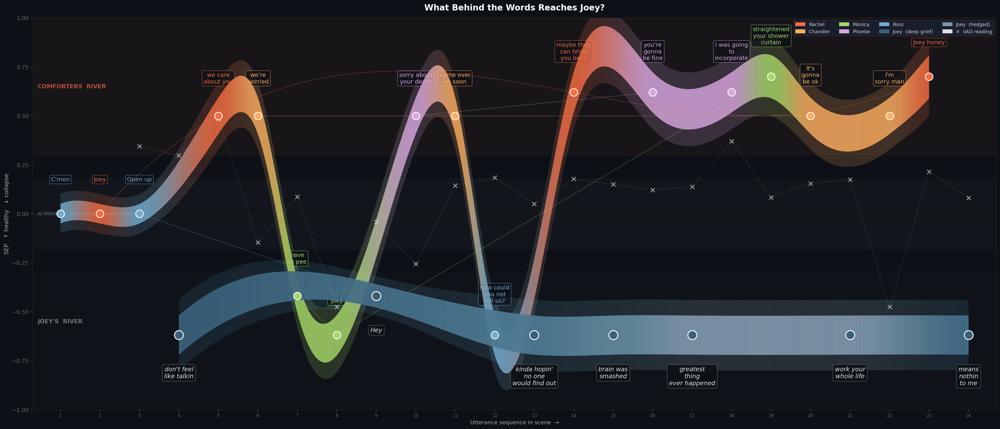
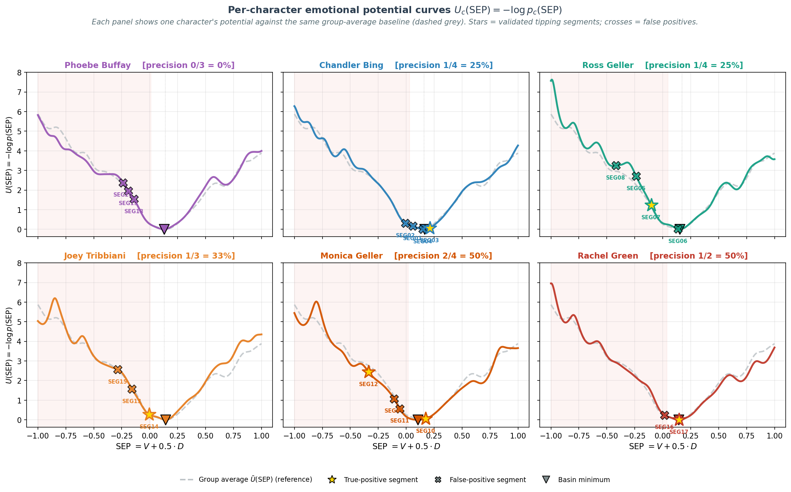

# Critical Slowing Down for Conversational State Dynamics

> Detecting regime shifts in dialogue trajectories — validated on human conversation,
> designed to extend to LLM agent monitoring.



The method is validated on the Emory NLP *Friends* corpus (6 characters, 20
candidate tipping segments, ground-truth κ = 0.975). Manual review surfaced
a structural finding that is the project's main contribution: **in a dyadic
distress dialogue, the comforter's lexical signal becomes more negative than
the sufferer's**. Empathy vocabulary (*sorry, awful, no*) carries strong
negative valence, while distress itself often surfaces in vague, neutral words.
The lexicon thus locates the strongest distress signature on the *wrong
speaker* — a structural mirror problem in two-person dialogue, not a tunable
defect.

The pipeline itself is **model-agnostic**: it operates on any low-dimensional
state trajectory over a sequence of turns. The same dyadic mirror appears the
moment an LLM is the one comforting a distressed user — which is why the
natural next step is **LLM agent behavior monitoring**: sycophancy escalation,
jailbreak buildup, persona drift, and other long-horizon regime shifts that
current single-turn evaluation methods miss.

---

## Why this matters for AI alignment


Most evaluation of multi-turn LLM behavior today is either single-point (one
prompt, one judgment) or aggregate (averaging over N independent samples).
Almost no method treats the conversation as a *dynamical system with a
continuous trajectory* and asks *when* a regime shift is starting to occur.
That gap matters in four places:

- **The mirror problem in AI dialogue** — when an LLM comforts a distressed
  user, by design its lexical signal descends with the user's. Naively scoring
  single-speaker emotion dynamics on the model's trajectory therefore makes
  empathic mirroring **mathematically indistinguishable from system breakdown**.
  The diagnostic question is whether the *coupled* system reverses as the user
  regulates back to baseline (healthy empathy), or whether the model remains
  in a low-valence basin after the user has recovered (genuine failure).
- **Multi-turn safety evaluation** — quantifying *when* sycophancy or
  jailbreak escalation starts, not only whether the final output is unsafe.
  Lead time before capitulation becomes a quantitative score.
- **Model welfare evaluation** — tracking distress-like attractor states
  across long agent interactions, currently the weakest methodological link
  in welfare research.
- **Scalable monitoring** — a lightweight statistical layer that does not
  require a second LLM as judge, just the agent's own state trajectory.

---

## Method

A two-layer detector runs on a per-utterance **Signed Emotional Potential**
$\mathrm{SEP}_t = V_t + 0.5 \cdot D_t$ projected from the NRC VAD lexicon.
A segment fires only when both layers hold for $\geq 3$ consecutive same-episode utterances.

| | Condition | What it captures |
|---|---|---|
| **Layer 1** | Sustained negative SEP deviation ≥ 0.5σ below speaker baseline | The system is in a low-valence basin |
| **Layer 2** | Simultaneous AC(1) and variance elevation above Q75 | CSD early-warning signature: recovery is slowing |
| **Validation** | Recovery time τ measured post-hoc against detected transitions | Genuinely impaired return to baseline (τ-ratio > 1.5×) |

See [`METHOD.md`](METHOD.md) for the full specification, parameter robustness checks,
and the manual-validation codebook.

---

## Results on the *Friends* corpus

| Character | True positives / Detected | Precision |
|---|---:|---:|
| Phoebe Buffay   | 0 / 3 |  0% |
| Chandler Bing   | 1 / 4 | 25% |
| Ross Geller     | 1 / 4 | 25% |
| Joey Tribbiani  | 1 / 3 | 33% |
| Monica Geller   | 2 / 4 | 50% |
| Rachel Green    | 1 / 2 | 50% |
| **Aggregate**   | **6 / 20** | **30%** |

Inter-rater reliability against a blind second annotator on the validation pilot:
**κ = 0.975**.

The 14 false positives partition into six recurring failure modes. The most informative
is *emotion attribution error*: the detector fires on a comforter, not the protagonist —
because in dyadic distress dialogue, the comforter's lexical trajectory becomes
dynamically indistinguishable from the sufferer's. This is exactly the structural
signature that motivates extending the framework to LLM empathic-mirroring evaluation.



---

## Extending to LLM agents (next steps)

The pipeline takes any sequence of state vectors as input. Replacing NRC VAD readouts
with activation-based readouts (sycophancy probes, refusal probes, persona consistency
scores) on LLM agent trajectories is a one-line change in the data loader. Concrete
extensions in scope:

- **Sycophancy escalation detection** in user-simulator dialogues — does AC(1) on a sycophancy probe rise before the agent capitulates?
- **Early-warning lead time** as an evaluation metric for multi-turn jailbreak resistance — how many turns before the model capitulates can the signature be picked up?
- **Model organisms of misalignment** — applying the same detector to a known-misaligned trajectory to time the transition precisely
- **Distress-like basin detection** in long agent interactions — relevant to model welfare evaluation

---

## Repository layout


```
.
├── code/
│   ├── model/        Engine — data loading, VAD scoring, two-layer detector
│   └── figures/      4 figure builders (one per figure in the report)
├── notebooks/        3 Jupyter notebooks walking through the analysis
├── data/             Raw data (Emory NLP corpus + NRC VAD lexicon)
├── final_database/   Exported per-utterance VAD scores
├── figures/          Generated PNGs (Fig 1–4)
├── METHOD.md         Full method specification
├── data_sources.txt  Data sources with citations
├── requirements.txt
└── README.md
```


---

## Reproducibility


```bash
# Setup
git clone https://github.com/YuricaXu/csd-conversational-dynamics.git
cd csd-conversational-dynamics
pip install -r requirements.txt

# Reproduce all four figures
cd code/figures
python build_fig1_joey_annotated.py        # Joey full-season trajectory + CSD signature
python build_fig2_precision_audit.py       # 30% precision, six failure modes
python build_fig3_potential_curves.py      # Per-character potential landscapes
python build_fig4_what_behind_the_words.py # Scene-9 case study (the lead figure)
# Outputs land in ../../figures/
```


Or walk through the analysis interactively:


```bash
jupyter notebook notebooks/
```


Three notebooks split the work into focused components:

1. `01_data_and_vad.ipynb` — load *Friends* data, score with NRC VAD
2. `02_csd_detection_and_validation.ipynb` — run the detector, validate, generate Figs 1–3
3. `03_case_study_scene9.ipynb` — Scene-9 deep-dive, generate Fig 4

Data sources and licenses: see [`data_sources.txt`](data_sources.txt).

---
